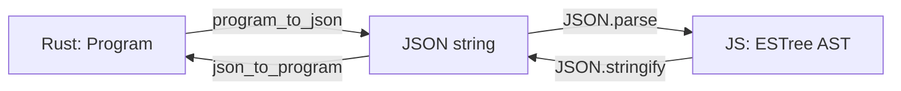

# Oxc ESTree Codec

A two-way codec between ESTree and oxc's typed AST.

## Usage

The codec works across a string boundary: the Rust side serializes a typed [`oxc`](https://docs.rs/oxc) `Program` into an ESTree JSON string (and reads a string back into a typed `Program`), while the JS side parses that string into an ESTree AST (and serializes an ESTree AST into a string).



**Rust → JS**: serialize a typed AST into an ESTree JSON string:

```rust
use oxc_estree_codec::{ProgramToJsonOptions, program_to_json};

let json: String = program_to_json(&program, ProgramToJsonOptions::default());
```

```ts
import type { Program } from "estree"; // npm i -D @types/estree

const ast: Program = JSON.parse(json); // JSON string → ESTree AST
```

**JS → Rust**: read an ESTree JSON string into a typed AST:

```ts
const json: string = JSON.stringify(ast); // ESTree AST → JSON string
```

```rust
use oxc::allocator::Allocator;
use oxc::ast::ast::{Program, SourceType};
use oxc_estree_codec::{JsonToProgramOptions, json_to_program};

let json: &str = r#"{"type":"Program","body":[...],"sourceType":"module"}"#;

let allocator: Allocator = Allocator::default();

let source_text: &str = "const x = 1;";

let program: Program<'_> = json_to_program(
    json,
    JsonToProgramOptions {
        allocator: &allocator,
        source_type: SourceType::from_path("index.js").unwrap(),
        source_text,
    },
)?;
```

## Contributing

For contributing, please refer to the [contributing guide](./CONTRIBUTING.md).

## License

This project is licensed under the terms of the MIT license.
